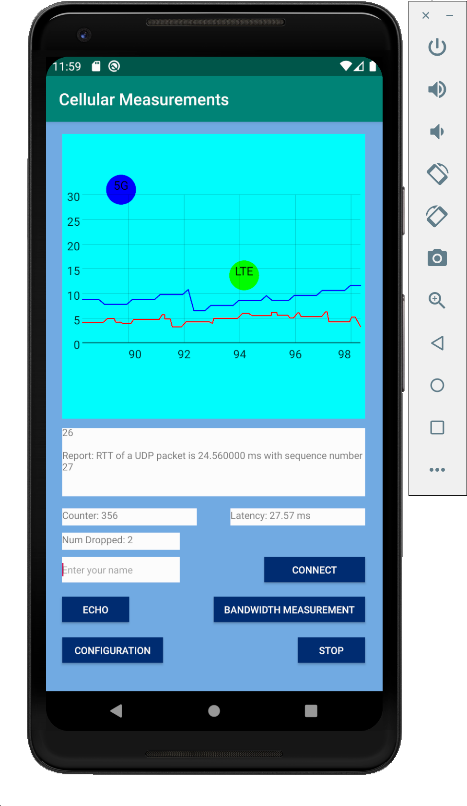
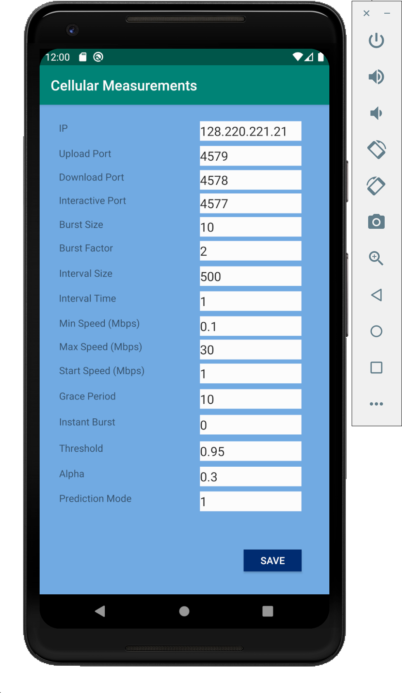

# Bandwidth Measurement

An Android application aimed towards testing real time capabilities over 5G and LTE networks. It integrates [cellular-measurement][https://github.com/jerrychen017/cellular-measurement] to measure cellular bandwidth and network latency. It also includes interactive functionality to test real-time interactivity. 

## Getting Started

These instructions will get you a copy of the project up and running on your local machine for development and testing purposes. See deployment for notes on how to deploy the project on a live system.

### Prerequisites

1. Server with three open UDP ports. One port for running the interactive server, and two ports for running bandwidth measurement server. 
If you want to run bandwidth measurement over TCP, make sure TCP ports are open. 

2. An Android phone or a computer with Android Studio installed (so you can run on emulator). 

### How to run

1. Get server programs from [cellular-measurement][https://github.com/jerrychen017/cellular-measurement].  
They are located under the directory ```executables/```

2. Run server programs  
To run `bandwidth_server`:
```
./bandwidth_server <server_send_port> <server_send_port>
```
e.g. 
```
./bandwidth_server 4576 4577
```
To run `interactive_server`:
```
./interactive_server <interactive_port> <max_num_users> 
```
e.g.
```
./interactive_server 10 
```
 3. Run the Android App  
      

 * `Echo` button sends a UDP packet to the server and measures the RTT (round-trip-time) between client (your phone) and server.
 * `Bandwidth Measurement` button measures upload/download speed.
 * `Stop` button stops the bandwidth measurement. 
### Break down into end to end tests

Explain what these tests test and why

```
Give an example
```

### And coding style tests

Explain what these tests test and why

```
Give an example
```

## Deployment

Add additional notes about how to deploy this on a live system

## Built With

* [Dropwizard](http://www.dropwizard.io/1.0.2/docs/) - The web framework used
* [Maven](https://maven.apache.org/) - Dependency Management
* [ROME](https://rometools.github.io/rome/) - Used to generate RSS Feeds

## Contributing

Please read [CONTRIBUTING.md](https://gist.github.com/PurpleBooth/b24679402957c63ec426) for details on our code of conduct, and the process for submitting pull requests to us.

## Versioning

We use [SemVer](http://semver.org/) for versioning. For the versions available, see the [tags on this repository](https://github.com/your/project/tags). 

## Authors

* **Billie Thompson** - *Initial work* - [PurpleBooth](https://github.com/PurpleBooth)
See also the list of [contributors](https://github.com/your/project/contributors) who participated in this project.

## License

This project is licensed under the MIT License - see the [LICENSE.md](LICENSE.md) file for details

## Acknowledgments

* Hat tip to anyone whose code was used
* Inspiration
* etc